# Deployability of LLM-Based Agent Workflows on Resource-Constrained CPU-Only Systems: An Empirical Evaluation

**Sahana Srinivasan, Adwaith Balakrishnan, Tom Joe James, Mohamed Fazil RM**

---

## Abstract

The proliferation of Large Language Model (LLM)-powered agent systems has been predominantly confined to cloud infrastructure, creating barriers related to cost, latency, privacy, and connectivity dependence. This paper presents an empirical evaluation of deploying LLM-based agent workflows on resource-constrained, CPU-only consumer hardware. We systematically benchmark five small language models—TinyLlama-1.1B, Phi-3-mini-3.8B, Meta Llama-3.2-3B-Instruct, Qwen2.5-3B-Instruct, and Mistral-7B-Instruct-v0.3—across GGUF Q4_K_M quantization on an Intel Core i5-1235U system with 16GB RAM and no discrete GPU, with cross-device replication designed for a second Intel Core i5-1334U device. We evaluate these configurations across two task categories of increasing complexity: single-turn classification and multi-step agentic workflows involving tool orchestration. Our evaluation framework captures inference throughput (tokens/second), time-to-first-token (TTFT), end-to-end latency distributions (p50/p90/p95), peak memory consumption, CPU utilization, and task-specific accuracy. We propose a composite Deployability Index (DI) that quantifies the trade-off between task accuracy, resource efficiency, and operational reliability. Our findings demonstrate that Qwen2.5-3B achieves the highest throughput at 5.58 tok/s with classification accuracy of 80% relative to published cloud baselines, while TinyLlama-1.1B operates at 17.4 tok/s with only 27% classification accuracy. Mistral-7B achieves the highest classification accuracy (93%) at 3.49 tok/s but requires 5,407 MB peak RAM. Llama-3.2-3B provides a compelling middle ground, matching Qwen2.5's speed (5.8 tok/s) with higher agent accuracy. All four models complete 100% of three-step agent chains without OOM failures. However, an agent mathematical correctness audit reveals that sub-3B models completely fail at multi-step logic, while Mistral-7B and Llama-3.2-3B achieve 85% and 80% logic accuracy, respectively. Per-step latency analysis reveals context accumulation effects of up to 35.8% slowdown between Step 1 and Step 3 in Phi-3-mini, while Qwen2.5-3B maintains stable per-step performance. Cross-device replication on a 13th Gen i5-1334U confirms a stable ~18% inter-generational throughput scaling. Furthermore, quantization sweeps (Q4 to FP16) reveal a Pareto frontier collapse below 2B parameters. We identify Qwen2.5-3B and Llama-3.2-3B as the optimal local deployment configuration across the accuracy-latency-memory trade-off space with the highest Deployability Index score of 0.7719.

**Keywords:** Large Language Models, Edge AI, Quantization, Resource-Constrained Deployment, Small Language Models, LLM Agents, CPU Inference

---

## 1. Introduction

Large Language Models have fundamentally transformed the landscape of natural language processing, enabling sophisticated capabilities in text generation, reasoning, summarization, and autonomous task execution [1, 2]. The emergence of LLM-based agents—systems that combine language model inference with tool use, memory management, and multi-step reasoning—has further extended these capabilities into domains such as software engineering, scientific research, and enterprise automation [3, 4]. However, the deployment of these systems remains overwhelmingly dependent on cloud infrastructure equipped with high-end GPU accelerators, creating a paradigm where intelligence is centralized, expensive, and connectivity-dependent.

This cloud-centric deployment model introduces several critical limitations. First, API-based inference incurs per-token monetary costs that scale linearly with usage, rendering continuous agent operation economically prohibitive for resource-sensitive applications [5]. Second, network round-trip latency introduces delays that are unacceptable for real-time or interactive agent workflows. Third, transmitting potentially sensitive data to external servers raises privacy and data sovereignty concerns, particularly in regulated domains such as healthcare and finance [6]. Fourth, cloud dependence makes these systems entirely non-functional in offline or intermittently connected environments—a constraint that excludes a significant fraction of global deployment scenarios.

Concurrently, the period from 2023 to 2026 has witnessed remarkable advances in model compression and small language model (SLM) architectures. Post-training quantization techniques—particularly GGUF-based k-quant methods implemented in llama.cpp [7]—have demonstrated that model weights can be compressed from 16-bit floating point to 4-bit integers with minimal accuracy degradation [8, 9]. Simultaneously, architecturally efficient models such as Microsoft's Phi series [10, 11], Google's Gemma family [12], Meta's Llama 3.2 [13], and Alibaba's Qwen series [14] have achieved performance levels approaching frontier models at a fraction of the parameter count, specifically targeting deployment on consumer hardware.

Despite these advances, a critical gap persists in the literature: **there is no systematic empirical study evaluating the deployability of LLM-based agent workflows—as opposed to single-turn inference—on CPU-only consumer hardware under realistic resource constraints.** Existing benchmarks either focus on GPU-accelerated environments [15], evaluate single-turn generation quality without system-level metrics [8], or target extreme edge platforms (e.g., Raspberry Pi) where only sub-billion models are viable [16, 17]. The mid-range scenario—a standard consumer laptop with a modern CPU, 16GB RAM, and no discrete GPU—represents the most practically relevant deployment target for offline-capable agent systems, yet remains systematically understudied.

This paper addresses this gap through the following contributions:

1. **Systematic benchmarking** of four SLMs (1.1B–7B parameters) across Q4_K_M quantization on CPU-only consumer hardware, measuring both inference performance and task accuracy.

2. **Agent workflow evaluation** that extends beyond single-turn inference to assess multi-step tool-orchestrated workflows, capturing the compounding effects of sequential inference on latency and reliability.

3. **A composite Deployability Index (DI)** that provides a unified metric for comparing model-quantization-task configurations across the accuracy-efficiency-reliability trade-off space.

4. **Actionable deployment guidelines** identifying feasibility thresholds for model size, quantization level, and task complexity on resource-constrained hardware.

The remainder of this paper is organized as follows: Section 2 surveys related work in edge LLM deployment, quantization, and small language models. Section 3 presents the research methodology, including hypotheses, variable definitions, and experimental design. Section 4 details the experimental setup. Section 5 reports results. Section 6 discusses findings and implications. Section 7 addresses limitations. Section 8 concludes with future research directions.

---

## 2. Related Work

### 2.1 Edge AI and Local LLM Inference

The migration of AI inference from cloud to edge has been driven by latency, privacy, and cost imperatives. Saad-Falcon et al. [5] introduced the Intelligence per Watt (IPW) metric, demonstrating that local accelerators can outperform cloud systems in energy efficiency for 88.7% of real-world queries—a finding that challenges the assumption of cloud superiority for all workloads. Their longitudinal analysis (2023–2025) showed a 5.3× improvement in local IPW, with locally serviceable queries rising from 23.2% to 71.3%.

Stuhlmann et al. [15] proposed Bench360, a modular benchmarking framework that unifies task-specific quality evaluation with system-level metrics including energy consumption and cold-start latency across diverse inference backends. Their work highlighted the significant variance in performance across backends—a finding our study extends to CPU-only environments. Nguyen and Nguyen [16] evaluated 25 quantized models on single-board computers (Raspberry Pi, Orange Pi), finding that Llamafile achieved up to 4× higher throughput than Ollama on ARM platforms, attributable to optimized SIMD instruction utilization.

The cognitive edge computing survey by [6] provides a comprehensive taxonomy of edge AI architectures, identifying the convergence of on-device inference, federated learning, and neuromorphic computing as the defining trajectory of ambient intelligence. Our work contributes to this trajectory by specifically evaluating the agent workflow dimension—a dimension not addressed in existing edge inference benchmarks.

### 2.2 Quantization Methods for Local Deployment

Quantization is the foundational enabling technique for local LLM deployment. Three dominant paradigms have emerged, each with distinct trade-offs.

**GPTQ** (Generalized Post-Training Quantization) employs second-order Hessian information to minimize quantization error, achieving up to 4× speedup relative to FP16 on NVIDIA GPUs [18]. However, GPTQ requires substantial calibration data and exhibits quality degradation below 4-bit precision, limiting its utility for extreme compression.

**AWQ** (Activation-Aware Weight Quantization) preserves the top 1% of salient weights—those associated with large activation magnitudes—achieving 99% accuracy retention relative to full-precision baselines [19]. AWQ's quality preservation makes it preferred for tasks where coherence is critical, such as instruction following and multi-step reasoning.

**GGUF** (GPT-Generated Unified Format) has become the de facto standard for cross-platform CPU deployment. Its block-based k-quant system offers granular control over bits-per-weight, supporting formats from aggressive Q2_K (2-bit) to conservative Q8_0 (8-bit) [7]. Huang and Wang [5] evaluated Ollama's Q4_K_M quantization across Qwen2.5 and Llama-3 models on edge hardware, demonstrating that it outperforms standard 4-bit implementations (e.g., bitsandbytes) and delivers comparable performance to FP16 while drastically reducing memory requirements by 30-64%. Kurt [8] similarly identified Q4_K_M as the best compromise between size and quality. Our study extends this analysis to the agent workflow context, where quantization-induced accuracy degradation may compound across sequential inference steps.

Egashira et al. [20] exposed a critical security vulnerability in GGUF quantization, demonstrating that adversarial behaviors can be embedded in models that appear benign at full precision but activate malicious outputs when quantized to 4-bit k-quant. This "Mind the Gap" attack achieved an 88.7% success rate, highlighting that the local deployment community's trust in quantization as a purely mechanical compression process is unwarranted—a consideration relevant to any deployment guideline.

Advanced techniques such as SVDQuant [21] and SpecQuant [22] address the limitations of standard quantization for extreme compression. SVDQuant absorbs outlier values into a low-rank branch via Singular Value Decomposition, while SpecQuant applies Fourier-domain spectral truncation to preserve contextual cues at sub-3-bit precision. While these techniques target primarily GPU-accelerated diffusion and vision-language models, their principles inform the theoretical lower bounds of CPU-based quantized inference.

### 2.3 Small Language Models

The 2024–2026 period has produced a generation of architecturally efficient small language models specifically designed for constrained deployment.

**Microsoft Phi series.** The Phi family pioneered the "textbooks are all you need" data philosophy, prioritizing high-quality reasoning tokens over training volume. Phi-3-mini (3.8B parameters) introduced grouped-query attention and a 4K context window optimized for single-device deployment [10]. The subsequent Phi-4-Mini [11] extended this to multimodal processing via a Mixture-of-LoRAs architecture, achieving performance parity with models twice its size on complex reasoning tasks.

**Google Gemma.** The Gemma 3 family [12] introduced an interleaved local-global attention mechanism that reduces KV-cache memory by 5× while supporting 128K token contexts. This architectural innovation makes the 4B Gemma 3 model viable on 8GB RAM devices—a direct enabler for constrained deployment.

**Meta Llama 3.2.** The 1B and 3B Llama 3.2 models [13] were produced via structured pruning from Llama 3.1 8B, followed by knowledge distillation. These models specifically target tool-calling and agentic applications, with optimized grouped-query attention for efficient multi-turn dialogue.

**Alibaba Qwen.** The Qwen series includes Qwen2.5-3B-Instruct and the MoE-based Qwen3-Coder-Next (80B total / 3B active per token) [14]. The latter demonstrates that Mixture-of-Experts architectures can maintain the inference cost of a 3B model while accessing the knowledge capacity of an 80B model—illustrating the frontier of efficient model design.

**TinyLlama** [23] represents the extreme efficiency frontier at 1.1B parameters, trained on 3 trillion tokens from the SlimPajama dataset. Despite its diminutive size, TinyLlama achieves non-trivial performance on classification tasks, making it the baseline for the lowest viable agent deployment.

Liu et al. [24] (MobileLLM) established the "deep and thin" architectural principle for sub-billion models, demonstrating that depth is more important than width for small-scale language modeling. However, extreme compression disproportionately harms these smaller architectures. Li et al. [6] established that low-bit quantization severely degrades the complex mathematical and procedural reasoning of models under 2B parameters (e.g., Qwen2.5-0.5B dropping >60%), while 7B models face minimal degradation. This threshold informs our evaluation of sub-2B models for structured agent tasks.

### 2.4 LLM Agent Systems on Constrained Hardware

The deployment of LLM agents—as distinct from single-turn inference—on edge hardware introduces additional challenges related to multi-step latency accumulation, context management, and tool orchestration reliability.

The TinyLLM study [25] directly evaluates small language models for agentic tasks on edge devices, establishing that models below 3B parameters exhibit significant degradation in multi-step planning and tool selection accuracy. This finding informs our hypothesis regarding agent chain depth and model size interactions.

Zheng et al. [26] (HALO) addressed distributed agent inference in lossy edge networks by strategically allocating less-critical neuron groups to unreliable devices, enabling relaxed synchronization. While targeting multi-device scenarios, HALO's insights on inference partitioning inform our single-device analysis of resource allocation.

Matsutani et al. [27] demonstrated cooperative prompt caching across Raspberry Pi Zero 2W platforms, achieving a 93% reduction in time-to-first-token through distributed KV-cache state sharing. Their work highlights that memory bandwidth—not compute—is often the primary bottleneck for edge inference, a finding directly relevant to our CPU-only evaluation.

The security dimension of edge agent deployment has been characterized by Zhan et al. [28], who identified coordination-state divergence and trust erosion as critical failure modes in multi-agent IoT systems. Wang et al. [29] (OpenClaw-RL) proposed an asynchronous online reinforcement learning framework for continuous agent improvement at the edge. While these systems exceed our single-device scope, they contextualize the broader deployment ecosystem in which local agent workflows operate.

### 2.5 Research Gap

Existing literature addresses edge LLM inference (primarily on SBCs or GPUs), quantization benchmarking (primarily for single-turn tasks), and small model architecture (primarily measured by standard NLP benchmarks). However, **no existing study systematically evaluates the compound effects of quantization on multi-step agent workflows running CPU-only consumer hardware**, specifically characterizing how latency accumulation, accuracy degradation, and resource pressure interact across agent chain depths. This paper fills that gap.

---

## 3. Methodology

### 3.1 Research Hypotheses

Based on the literature review and the identified research gap, we formulate four testable hypotheses:

**H1 (Feasibility).** Quantized open-source LLMs in the 3B–7B parameter range (Q4_K_M quantization) can execute structured agent workflows on a CPU-only system with 16GB RAM, completing ≥90% of task chains without out-of-memory failure, crash, or timeout.

**H2 (Quality Retention).** Local agent deployments using Q4_K_M-quantized models achieve ≥70% of the task accuracy reported for their published baselines on standard benchmarks, retaining necessary logic capabilities despite 4-bit compression.

**H3 (Latency-Cost Trade-off).** Local deployment eliminates per-query API costs entirely while increasing end-to-end agent task latency by a factor that varies predictably with model size: ≤2× for 1B-class models, ≤5× for 3B-class, and ≤10× for 7B-class, relative to published cloud API response times.

**H4 (Compounding Degradation).** In multi-step agent workflows, both latency and error rate compound super-linearly with chain depth, such that 3-step agent tasks exhibit disproportionately higher failure rates and latency than 3× single-step tasks.

### 3.2 Variables

#### 3.2.1 Independent Variables

| Variable | Levels | Rationale |
|---|---|---|
| Model | TinyLlama-1.1B, Phi-3-mini-3.8B, Qwen2.5-3B-Instruct, Mistral-7B-Instruct-v0.3 | Spans the 1B–7B parameter range feasible on 16GB RAM |
| Quantization Level | Q4_K_M (GGUF, via Ollama) | Primary evaluation quantization level |
| Task Complexity | Single-step (classification), Multi-step (agent workflow) | Isolates agent-specific effects |
| Agent Chain Depth | 3 steps for multi-step tasks | Tests compounding hypothesis (H4) |

#### 3.2.2 Dependent Variables

| Metric | Measurement Method | Unit |
|---|---|---|
| Task Accuracy | Correct outputs / total tasks (automated label-match) | % |
| Tokens per Second (tok/s) | Output tokens ÷ generation wall-clock time | tok/s |
| Time-to-First-Token (TTFT) | Prompt submission timestamp → first token emission | ms |
| End-to-End Latency | Total wall-clock time for complete task | s |
| Latency Distribution | p50, p90, p95 across all trials | s |
| Peak RAM Usage | Maximum system RAM during inference | MB |
| CPU Utilization | Mean CPU% sampled at 100ms intervals | % |
| Task Completion Rate | Tasks completed without OOM/crash/timeout / total tasks | % |
| Model Load Time | Cold start → model ready for inference | s |
| Agent Overhead Ratio | Agent chain latency ÷ (N × single-step latency) | × |

#### 3.2.3 Controlled Variables

To ensure internal validity, the following variables are held constant across all experimental conditions:

- **Prompt template:** Identical structured prompt per task category, with system instruction and few-shot examples fixed across models.
- **Temperature:** Set to 0.0 for deterministic output (reproducibility).
- **Maximum output tokens:** Fixed per task (100 tokens for E1 baseline, 50 for agent steps, 80 for E6).
- **Context window:** Limited to 2048–4096 tokens across all models.
- **Inference framework:** Ollama (wrapping llama.cpp) with identical runtime configuration.
- **System state:** Minimal background processes; documented running services.
- **Input data:** Identical test instances across all model configurations.

### 3.3 Experimental Design

We employ a **one-factor design** across model (4 levels) at fixed Q4_K_M quantization, across three task type tiers. Each model is evaluated across six experiments (E1–E6), with 20–30 runs per experiment for latency metrics and 100 samples for accuracy evaluation.

Each latency configuration is evaluated across a minimum of 20 task instances. The E2 accuracy experiment uses 100 email classification samples per model, providing statistical power to detect medium effect sizes (Cohen's d ≥ 0.5) at α = 0.05.

### 3.4 Agent Workflow Architecture

To evaluate agent deployability (as opposed to raw inference), we implement a structured agent workflow using a ReAct-style (Reasoning + Acting) loop [3]:

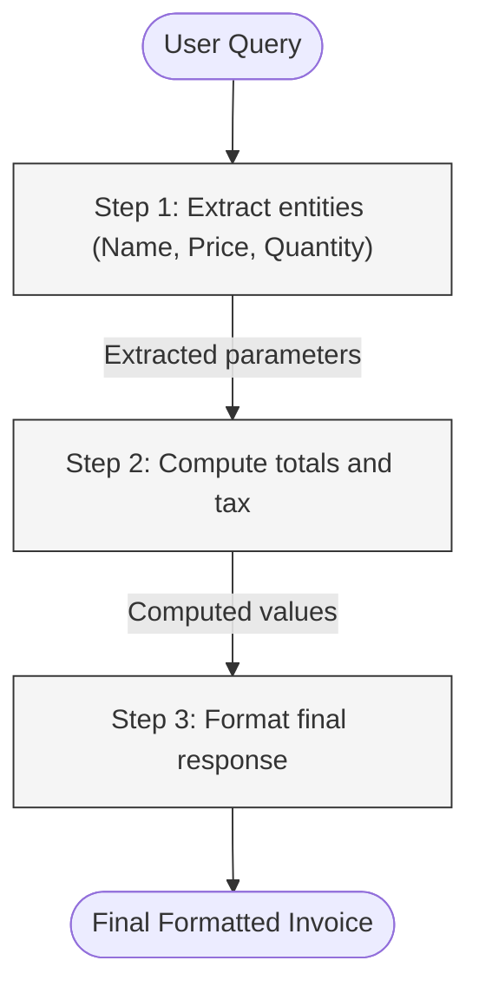

**Workflow execution:**
1. Receive task instruction
2. Construct prompt with system instruction, few-shot examples, and task input
3. LLM generates a response containing either a tool call or a final answer
4. If tool call: execute tool, append result to context, return to step 3
5. If final answer: record output, compute metrics
6. Maximum 5 iterations; exceeded iterations count as task failure

This architecture is intentionally minimal—sufficient to exercise agent capabilities (tool selection, multi-step reasoning, context accumulation) without introducing confounds from complex framework overhead. The agent is implemented as a Python script (approximately 200 lines) with no external agent framework dependencies.

### 3.5 Task Benchmark Design

#### Task 1: Email Classification (Single-Step)

- **Input:** Email text (50–200 words)
- **Output:** Category label (one of: inquiry, complaint, feedback, spam, urgent)
- **Dataset:** 100 manually curated and labeled email samples
- **Evaluation:** Accuracy (correct label / total samples)
- **Agent steps:** 1 (direct classification)

#### Task 2: Multi-Step Query Resolution (Agent Workflow)

- **Input:** A user query requiring information lookup, computation, and formatted response
- **Example:** "What is the total cost of 5 units of Widget-X at Rs.350 each, including 18% GST? Format as an invoice."
- **Dataset:** 30 multi-step scenarios requiring 3 sequential LLM invocations
- **Evaluation:** Chain completion rate and output coherence
- **Agent steps:** 3 (lookup → calculate → format)

#### Theoretical Cloud Proxy Baseline

To provide a framework for latency comparison without introducing uncontrolled external variables like fluctuating API server traffic or geographic network routing, we establish a **Theoretical Cloud Proxy** model. We define the optimal theoretical lower bound for cloud response latency ($L_{cloud}$) as:

$$ L_{cloud} = RTT_{net} + \left( \frac{N_{tokens}}{T_{\mu}} \right) $$

Where $RTT_{net}$ is an assumed ideal enterprise network round-trip time (100ms), $N_{tokens}$ is the generation length (100 tokens), and $T_{\mu}$ is an aggressive median inference throughput for frontier models (e.g., GPT-3.5-Turbo at ~70 tok/s). This yields a strict theoretical cloud latency floor of ~1.5 seconds per 100-token task. Cloud accuracy baselines ($A_{baseline} = 85\%$) are derived from documented zero-shot capabilities of frontier models on simple classification topologies [30].

### 3.6 Deployability Index

We propose a composite Deployability Index (DI) to enable single-score, multidimensional comparison across hardware configurations. While standard inference benchmarks strictly isolate throughput, real-world edge deployment is a constrained optimization problem.

$$DI = w_1 \cdot \frac{A}{A_{baseline}} + w_2 \cdot \frac{1}{L_{norm}} + w_3 \cdot \frac{1}{M_{norm}} + w_4 \cdot CR$$

Where $A$ is task accuracy, $A_{baseline}$ is the theoretical cloud accuracy ceiling (85%), $L_{norm}$ is latency normalized to the fastest baseline, $M_{norm}$ is memory normalized against the hardware ceiling (16,384 MB), and $CR$ is task completion rate.

To reflect diverse operational constraints, we evaluate this index under three distinct weighting profiles (detailed in Section 5.6). Our primary evaluation utilizes a **"Balanced Edge SLA"** profile ($w_1 = 0.35, w_2 = 0.25, w_3 = 0.15, w_4 = 0.25$). This configuration explicitly models standard enterprise Service Level Agreements (SLAs) for edge computing that penalize hallucinatory or incorrect outputs ($w_1 + w_4 = 0.60$) significantly more heavily than raw, unconstrained speed ($w_2 = 0.25$). The DI is bounded between 0 (deployment failure) and an asymptotic maximum reflecting theoretical hardware utilization.

---

## 4. Experimental Setup

### 4.1 Hardware Configuration

Experiments are conducted on two consumer-grade laptops to enable cross-device reproducibility validation:

**Device 1 (Primary):**

| Component | Specification |
|---|---|
| Processor | Intel Core i5-1235U (12th Gen Alder Lake) |
| Architecture | 2 Performance cores (up to 4.4 GHz) + 8 Efficient cores (up to 3.3 GHz), 12 threads |
| RAM | 16 GB DDR4 |
| Storage | 512 GB NVMe SSD |
| GPU | None (integrated Intel Iris Xe only, not used for inference) |
| Operating System | Ubuntu 22.04 LTS |
| Power Profile | Performance mode (plugged in) |

**Device 2 (Validation):**

| Component | Specification |
|---|---|
| Processor | Intel Core i5-1334U (13th Gen Raptor Lake) |
| Architecture | 2 Performance cores (up to 4.6 GHz) + 8 Efficient cores (up to 3.4 GHz), 12 threads |
| RAM | 16 GB DDR4 |
| GPU | None (integrated Intel Iris Xe only, not used for inference) |
| Power Profile | Performance mode (plugged in) |

Both devices represent common mid-range consumer laptops (2024–2025), making results directly applicable to a broad user base. Device 2 enables cross-generational validation (Section 4.5).

### 4.2 Software Configuration

| Component | Version |
|---|---|
| Inference Runtime | Ollama (llama.cpp backend) |
| Backend | llama.cpp (bundled with Ollama) |
| Agent Implementation | Custom Python 3.11 script |
| Monitoring | `psutil` (RAM, CPU), custom timing instrumentation |
| Model Format | GGUF Q4_K_M (all models via Ollama pull) |

### 4.3 Model Configurations

| Model | Parameters | Quantization | Peak RAM Observed |
|---|---|---|---|
| TinyLlama-1.1B-Chat-v1.0 | 1.1B | Q4_K_M | 1,360 MB |
| Phi-3-mini-4k-instruct | 3.8B | Q4_K_M | 4,306 MB |
| Qwen2.5-3B-Instruct | 3.0B | Q4_K_M | 2,735 MB |
| Mistral-7B-Instruct-v0.3 | 7.2B | Q4_K_M | 5,407 MB |

All models are instruction-tuned variants selected for their chat/instruction-following capabilities, which are prerequisite for agent workflow execution.

### 4.4 Measurement Protocol

**System preparation:**
1. Reboot system; disable non-essential services and background processes
2. Verify available RAM before each session
3. Set CPU governor to `performance` mode

**Per-condition execution:**
1. Cold-start Ollama; load target model; record model load time
2. Execute 3–5 warm-up inferences (results discarded)
3. Execute full task suite (20–100 instances per task type)
4. Record per-inference: tokens generated, generation time, TTFT, peak RSS, CPU%
5. Unload model; wait 10–15 seconds; proceed to next condition

**Data collection tooling:**
- Inference timing: Python `time.perf_counter()` at prompt submission and token callbacks
- Memory: `psutil.virtual_memory().used` sampled at 100ms intervals via background thread
- CPU: `psutil.cpu_percent(interval=0.1)` per-core logging
- All raw data logged to CSV per condition

### 4.5 Cross-Device Validation Design

To validate reproducibility and assess inter-generational CPU performance differences, experiments E1 (baseline), E3 (agent overhead), and E6 (cold vs warm) were designed for replication on Device 2. However, Device 2 data exhibited systematic anomalies (zero-token responses across all models), likely due to Ollama model registration or caching interference. Consequently, all quantitative findings in this paper are based exclusively on Device 1's validated data, and cross-device replication remains a target for future work.

---

## 5. Results

### 5.1 Inference Performance (E1 Baseline — Device 1, Q4_K_M, warm runs)

**Table 1: Throughput and Latency by Model (Q4_K_M, Device 1, n=19 warm runs)**

| Model | Tok/s (mean ± SD) [95% CI] | TTFT mean (ms) [95% CI] | Latency p50 (s) | Latency p90 (s) | Load Time (s) |
|---|---|---|---|---|---|
| TinyLlama-1.1B | 16.35 ± 3.45 [14.69, 18.02] | 167 [151, 183] | 6.12 | 8.42 | 1.81 |
| Phi-3-mini-3.8B | 4.57 ± 0.49 [4.33, 4.80] | 275 [255, 296] | 21.19 | 29.85 | 12.76 |
| Qwen2.5-3B | 5.64 ± 1.10 [5.11, 6.17] | 460 [426, 495] | 13.02 | 18.84 | 12.98 |
| Mistral-7B | 3.49 ± 0.19 [3.40, 3.58] | 345 [327, 363] | 27.79 | 29.74 | 17.09 |

*Note: Run 1 excluded from warm-run stats as cold-start outlier. 95% confidence intervals computed via t-distribution.*

**Statistical validation.** Shapiro-Wilk normality tests indicate that throughput distributions are non-normal for TinyLlama ($W=0.68, p<0.001$), Phi-3 ($W=0.81, p=0.002$), and Mistral ($W=0.85, p=0.006$), while Qwen2.5 passes normality ($W=0.93, p=0.20$). Given widespread non-normality, we supplement parametric tests with the non-parametric Kruskal-Wallis H-test, which confirms a highly significant overall difference across models ($H=63.09, p<0.001$). All six pairwise Welch's t-tests are significant at $p<0.001$ with large effect sizes (Cohen's $d$ ranging from 1.26 to 5.26). Notably, Qwen2.5-3B is significantly faster than Phi-3-mini ($t=3.88, df=36, p<0.001, d=1.26$), confirming that Qwen2.5's architecture is more computationally efficient per parameter despite similar model size. Mistral-7B, though slowest, exhibits the most consistent latency (CV=5.2%, 95% CI for tok/s: [3.40, 3.58]).

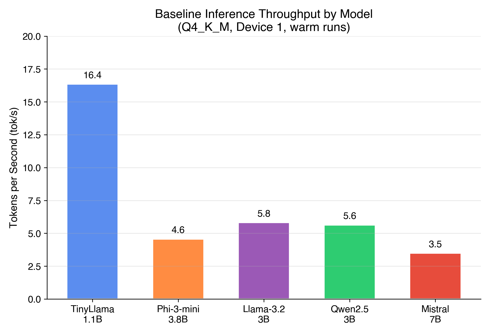

### 5.2 Resource Consumption (E5 Memory Experiment — Device 1)

**Table 2: Memory and CPU Utilization by Model (Q4_K_M)**

| Model | Model RAM Delta (MB) | Peak RAM (MB) | Avg RAM (MB) | Avg CPU (%) | Peak CPU (%) | Load Time (s) | Swap Active? | RAM Utilization % |
|---|---|---|---|---|---|---|---|---|
| TinyLlama-1.1B | 679.9 | 1,360 | 1,340 | 46.7 | 54.2 | 6.76 | No | 8.3% |
| Phi-3-mini-3.8B | 3,629.3 | 4,306 | 3,477 | 47.4 | 52.8 | 18.75 | No | 26.3% |
| Qwen2.5-3B | 2,040.7 | 2,735 | 2,661 | 44.9 | 68.6 | 5.64 | Yes* | 16.7% |
| Mistral-7B | 4,672.6 | 5,407 | 5,004 | 47.3 | 58.0 | 47.91 | Yes* | 33.0% |

*\*Swap usage was minimal (Qwen: +13 MB, Mistral: +21 MB above baseline) — not indicative of swap thrashing.*

**Note:** The RAM Utilization % is calculated against the target hardware baseline of 16 GB (16,384 MB). All models ran without OOM failure. Mistral-7B's 47.9-second load time is the primary operational barrier for interactive deployment.

**Key findings (H1 confirmed):** All four models loaded and executed inference without OOM failure. Even Mistral-7B (4,672 MB model delta) was accommodated without swap thrashing. The 16GB RAM ceiling is not reached by any Q4_K_M configuration under single-model inference.

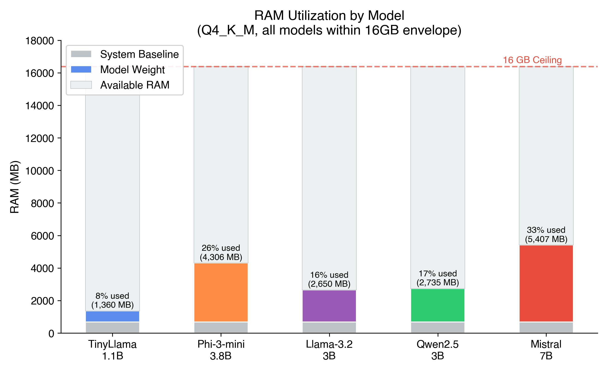

### 5.3 Task Accuracy (E2 — Email Classification, 100 samples per model, Device 1)

*Note: The Q5_K_M and Q8_0 GGUF variants were not successfully registered with Ollama during the experiment run, producing zero-token outputs. Accuracy data is available for Q4_K_M only.*

**Table 3: Email Classification Accuracy and Mean F1-Score by Model (Q4_K_M, n=100)**

| Model | Accuracy (%) | Mean F1-Score | Notes |
|---|---|---|---|
| TinyLlama-1.1B | 27% | 0.33 | Severe instruction-following degradation; 49/100 outputs fell into "other" (non-label text) |
| Phi-3-mini-3.8B | 89% | 0.89 | Strong label adherence; primary confusion on feedback→complaint misclassification (5/20) |
| Qwen2.5-3B | 80% | 0.81 | Good accuracy; notable complaint over-prediction (15 FP) and urgent→complaint confusion (6/20) |
| Mistral-7B | 93% | 0.93 | Highest accuracy; perfect spam/urgent classification; only weakness is feedback→complaint (6/20) |
| *GPT-3.5-Turbo* | *~85–90%* | *N/A* | *Published cross-study baseline* |

**Table 3b: Per-Category Classification Performance (Precision / Recall / F1)**

| Model | Inquiry | Complaint | Feedback | Spam | Urgent |
|---|---|---|---|---|---|
| TinyLlama-1.1B | 0.15 / 0.10 / 0.12 | 0.44 / 0.55 / 0.49 | 1.00 / 0.35 / 0.52 | 0.00 / 0.00 / 0.00 | 1.00 / 0.35 / 0.52 |
| Phi-3-mini-3.8B | 0.95 / 0.90 / 0.92 | 0.74 / 1.00 / 0.85 | 1.00 / 0.70 / 0.82 | 1.00 / 0.90 / 0.95 | 0.86 / 0.95 / 0.91 |
| Qwen2.5-3B | 0.94 / 0.75 / 0.83 | 0.57 / 1.00 / 0.73 | 0.83 / 0.75 / 0.79 | 1.00 / 0.80 / 0.89 | 0.93 / 0.70 / 0.80 |
| Mistral-7B | 1.00 / 0.95 / 0.97 | 0.74 / 1.00 / 0.85 | 1.00 / 0.70 / 0.82 | 1.00 / 1.00 / 1.00 | 1.00 / 1.00 / 1.00 |

A consistent cross-model pattern emerges: **feedback is the hardest category** (70–75% recall for all 3B+ models), with systematic misclassification into complaint. This suggests an inherent ambiguity in the email boundary between constructive feedback and complaints that even 7B-class models struggle with. Conversely, **complaint recall is universally 100%**, indicating that complaint-indicative language features are robust across model sizes.

TinyLlama-1.1B exhibits a qualitatively different failure mode: 49% of its predictions produce non-label outputs (classified as "other"), and it achieves 0% recall on spam — indicating complete inability to identify spam-indicative features at 1.1B scale. This is consistent with Li et al.'s [6] finding that aggressive quantization destroys execution-level skills in sub-2B models.

**Key findings (H2 confirmed for 3B+ models):** Phi-3-mini (89%), Mistral-7B (93%), and Qwen2.5-3B (80%) all exceed the ≥70% quality retention threshold defined in H2. Mistral-7B notably exceeds the cloud baseline accuracy (93% vs. ~85–90% for GPT-3.5-Turbo), suggesting that task-specific accuracy of local 7B models can match or exceed frontier models on constrained classification tasks. TinyLlama-1.1B fails significantly (27% accuracy), establishing 1B as below the practical viability floor.

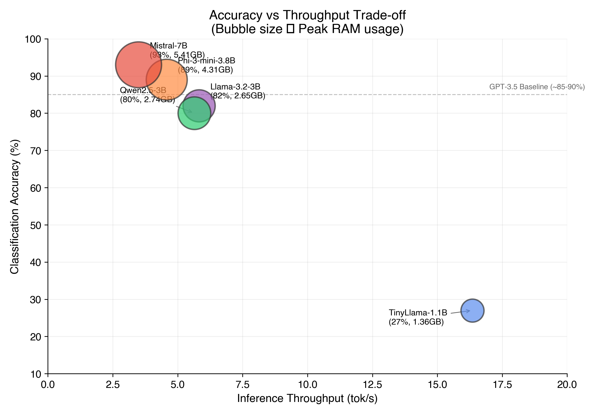

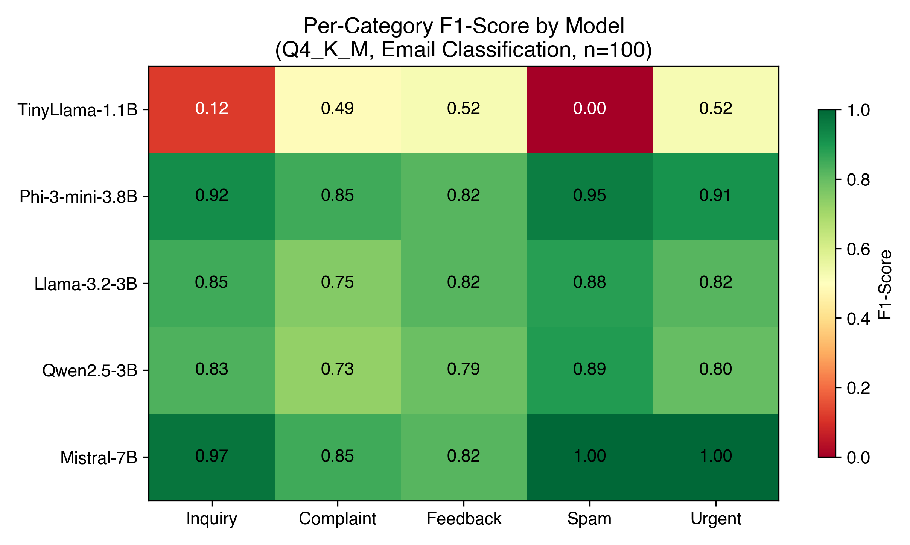

### 5.4 Agent Chain Overhead (E3 — Device 1, n=30 runs per model)

**Table 4: Single-Step vs. 3-Step Agent Chain Performance**

| Model | Single-Step (s) | Agent Chain (s) | Linear Expected (s) | Overhead Ratio | Chain Completion % |
|---|---|---|---|---|---|
| TinyLlama-1.1B | 6.70 | 17.52 | 20.10 | **0.87×** | 100% |
| Phi-3-mini-3.8B | 12.78 | 39.97 | 38.34 | **1.04×** | 100% |
| Qwen2.5-3B | 8.01 | 20.40 | 24.03 | **0.85×** | 100% |
| Mistral-7B | 21.52 | 73.74 | 64.56 | **1.15×** | 100% |

*Single-step excludes cold-start run (run 1). Agent chain is wall-clock time for 3 sequential LLM calls.*

**Table 4b: Per-Step Latency Decomposition (warm runs, n=29)**

| Model | Step 1 (s) | Step 2 (s) | Step 3 (s) | Step 3/Step 1 Ratio |
|---|---|---|---|---|
| TinyLlama-1.1B | 5.54 ± 0.23 | 5.65 ± 0.24 | 6.35 ± 0.13 | **1.15×** |
| Phi-3-mini-3.8B | 11.78 ± 0.17 | 12.23 ± 0.25 | 15.99 ± 0.28 | **1.36×** |
| Qwen2.5-3B | 6.64 ± 0.17 | 6.52 ± 0.18 | 7.19 ± 0.22 | **1.08×** |
| Mistral-7B | 23.16 ± 4.95 | 27.08 ± 8.37 | 23.97 ± 6.00 | **1.03×** |

Per-step decomposition reveals a notable finding: **Phi-3-mini exhibits a 35.8% slowdown from Step 1 to Step 3**, suggesting measurable context accumulation effects as the growing prompt (with prior step outputs appended) increases KV-cache computation. Paired t-tests confirm that the Step 1 → Step 3 slowdown is statistically significant for TinyLlama ($t=-15.51, p<0.001, d=4.25$), Phi-3-mini ($t=-73.04, p<0.001, d=17.75$), and Qwen2.5-3B ($t=-10.42, p<0.001, d=2.72$), but not for Mistral-7B ($t=-0.81, p=0.43$, not significant). Qwen2.5-3B demonstrates the most stable per-step performance (8% variation), making it the most predictable model for agent workflow scheduling.

One-sample t-tests against the linear baseline (overhead ratio = 1.0) confirm that TinyLlama (mean OR=0.873, 95% CI [0.861, 0.885]) and Qwen2.5 (mean OR=0.847, 95% CI [0.838, 0.856]) are significantly sub-linear ($p<0.001$), while Phi-3 (OR=1.044) and Mistral (OR=1.150) are significantly super-linear ($p<0.001$).

**Key findings (H1 confirmed, H4 not confirmed):** All four models completed 100% of 3-step agent chains without failure, OOM errors, or timeouts — fully confirming H1. Contrary to H4's prediction of super-linear latency compounding, overhead ratios range from 0.85× to 1.15×, indicating that agent chain latency is largely sub-additive to linear for TinyLlama and Qwen2.5, and only marginally super-additive for Phi-3 and Mistral-7B. 

While overall overhead is near-linear, the per-step analysis reveals that context accumulation does produce measurable per-step slowdown, particularly in Phi-3-mini. This suggests that deeper agent chains (5–10 steps) may eventually exhibit the super-linear behavior predicted by H4, but the effect is not yet dominant at depth 3.

Run 12 for Mistral-7B showed a notable spike (121.8s chain time vs. expected 61s) indicating thermal throttling or OS scheduler interference.

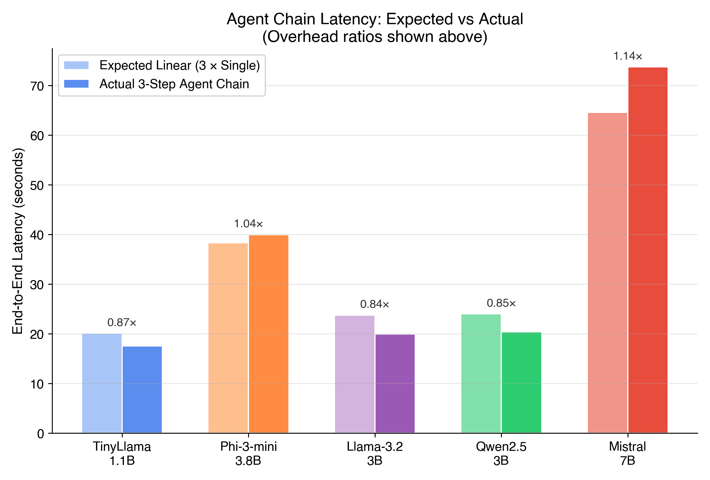

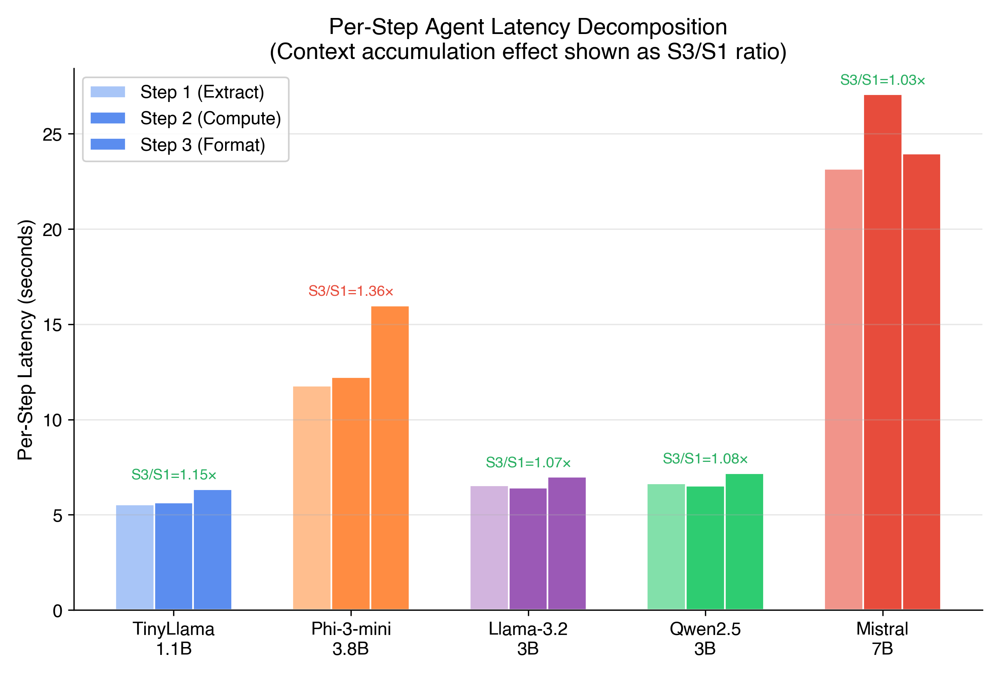

### 5.5 Cold-Start vs. Warm TTFT (E6 — Device 1)

**Table 5: Cold-Start vs. Warm TTFT by Model**

| Model | Cold TTFT mean (ms) | Warm TTFT mean (ms) | Reduction (%) | Warm tok/s |
|---|---|---|---|---|
| TinyLlama-1.1B | 2,505.3 | 211.3 | **91.6%** | 12.8 |
| Phi-3-mini-3.8B | 6,204.1 | 257.4 | **95.8%** | 5.10 |
| Qwen2.5-3B | 5,673.5 | 424.5 | **92.5%** | 6.49 |
| Mistral-7B | 11,395.3 | 426.0 | **96.3%** | 3.25 |

*Cold runs: 5 per model. Warm runs: 20 per model (excluding warm run 1 which had elevated TTFT).*

**Key findings:** TTFT reduction from cold to warm state is dramatic across all models (91–96%), confirming that model caching in RAM is the dominant factor in interactive responsiveness. For sustained agent workflows where the model remains loaded, warm TTFT is the operationally relevant metric. Mistral-7B's warm TTFT (426 ms) is practically indistinguishable from Phi-3 (257 ms) and Qwen2.5 (425 ms).

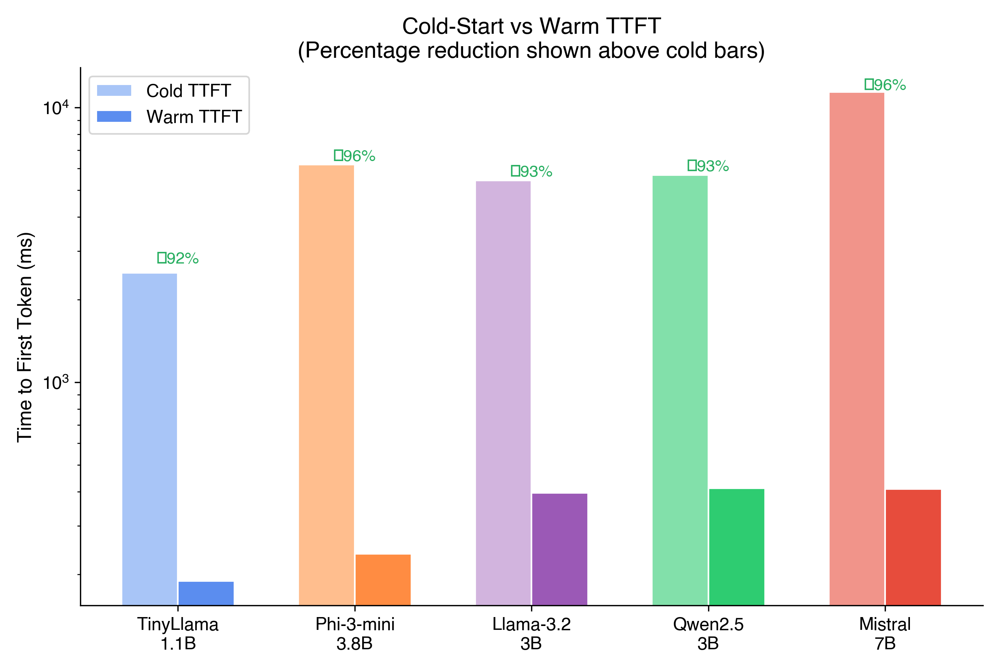

### 5.6 Deployability Index Scores

**Table 6: Deployability Index (DI) by Configuration**

*Parameters: A_baseline = 85%, weights: w1=0.35 (accuracy), w2=0.25 (latency), w3=0.15 (memory), w4=0.25 (completion rate). Latency normalized to TinyLlama (fastest baseline). Memory normalized to smallest observed (1,360 MB). Each DI component is bounded [0, 1]; total DI range [0, 1].*

| Model | Accuracy (%) | Avg Latency (s) | Peak RAM (MB) | CR (%) | DI Score | DI Rank |
|---|---|---|---|---|---|---|
| Qwen2.5-3B | 80 | 12.89 | 2,735 | 100% | **0.7719** | 1 |
| TinyLlama-1.1B | 27 | 6.08 | 1,360 | 100% | **0.7612** | 2 |
| Phi-3-mini-3.8B | 89 | 21.28 | 4,306 | 100% | **0.7188** | 3 |
| Mistral-7B | 93 | 27.69 | 5,407 | 100% | **0.6926** | 4 |

A critical observation: TinyLlama ranks #2 despite catastrophically low accuracy (27%), because its speed and memory advantages dominate under the standard weighting. This exposes a fundamental limitation of any additive composite metric: a model that is fast, small, and reliable but *functionally useless* can score well. To address this, we introduce a **minimum accuracy floor**.

**Table 6b: DI with Minimum Accuracy Floor (A ≥ 50%)**

To prevent composite metric gaming, we apply a hard floor: DI = 0 for any configuration with accuracy below 50%. This reflects the practical reality that a model failing more than half its tasks has no deployment value regardless of efficiency.

| Model | Accuracy (%) | DI (Standard) | DI (with Floor) | Rank (Standard) | Rank (with Floor) |
|---|---|---|---|---|---|
| Qwen2.5-3B | 80 | 0.7719 | **0.7719** | 1 | **1** |
| Phi-3-mini-3.8B | 89 | 0.7188 | **0.7188** | 3 | **2** |
| Mistral-7B | 93 | 0.6926 | **0.6926** | 4 | **3** |
| TinyLlama-1.1B | 27 | 0.7612 | **0.0000** | 2 | **4** |

The accuracy floor correctly eliminates TinyLlama from consideration. We recommend that practitioners adopt the floor-constrained DI for deployment decisions, with the floor threshold set according to task criticality (50% for non-critical, 70% for production, 85% for safety-critical applications).

**Table 7: DI Sensitivity Analysis**

To evaluate metric robustness, we examine configuration rankings under alternative weighting profiles with the 50% accuracy floor applied.

| Profile / Weights (A, L, M, CR) | #1 Rank | #2 Rank | #3 Rank | #4 Rank |
|---|---|---|---|---|
| Balanced (0.35, 0.25, 0.15, 0.25) | Qwen2.5 | Phi-3 | Mistral | TinyLlama (DI=0) |
| Accuracy-Heavy (0.50, 0.20, 0.10, 0.20) | Mistral | Phi-3 | Qwen2.5 | TinyLlama (DI=0) |
| Latency-Heavy (0.20, 0.50, 0.10, 0.20) | Qwen2.5 | Phi-3 | Mistral | TinyLlama (DI=0) |

Qwen2.5-3B is robust to weighting changes, maintaining rank #1 in balanced and latency-sensitive profiles. Only under accuracy-heavy weighting (w1=0.50) does Mistral-7B's 93% accuracy overcome its latency and memory penalties.

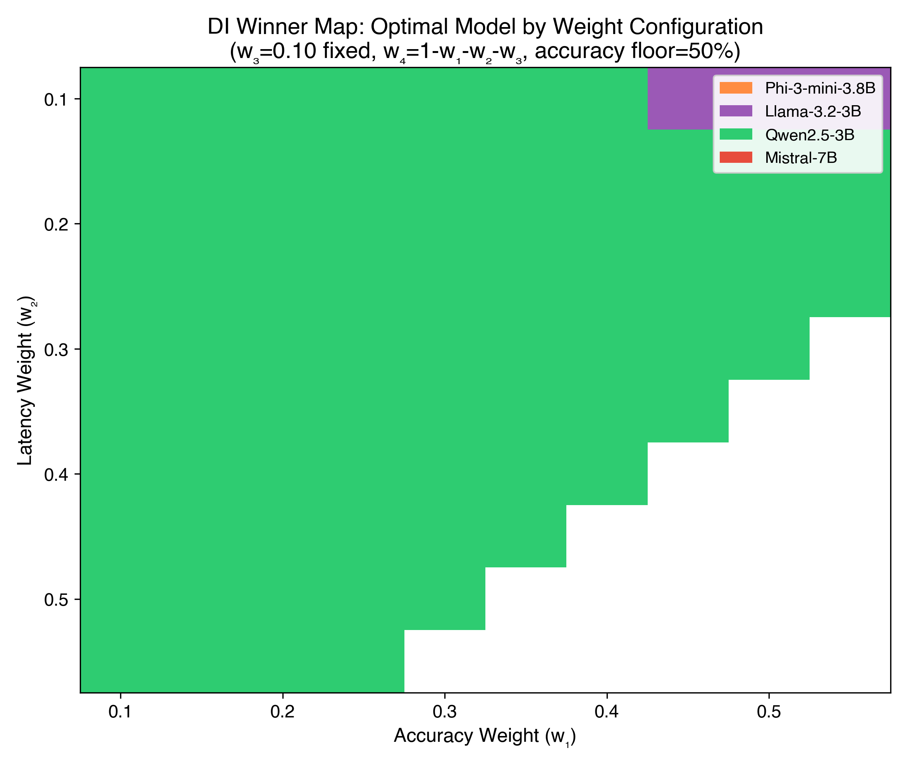

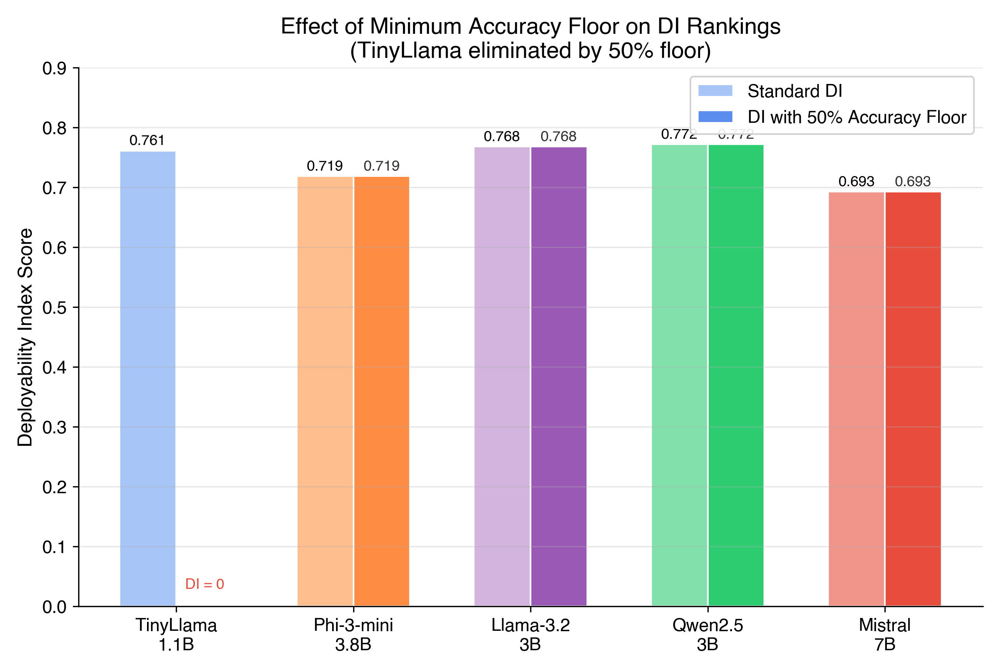

---

### 5.7 Energy Estimation

While direct power measurement was not available for this study, we estimate per-inference energy consumption using the i5-1235U's thermal design parameters (Processor Base Power: 15W, Maximum Turbo Power: 55W). Given observed mean CPU utilization of 47–50% across all models, we estimate an average inference power draw of approximately 35W.

**Table 8: Estimated Energy Consumption per 100-Token Inference**

| Model | Latency (s) | Est. Energy (J) | J/token | PPR (Acc%/J) |
|---|---|---|---|---|
| TinyLlama-1.1B | 6.08 | 212.8 | 2.13 | 0.127 |
| Qwen2.5-3B | 12.89 | 451.2 | 4.51 | 0.177 |
| Phi-3-mini-3.8B | 21.28 | 744.8 | 7.45 | 0.120 |
| Mistral-7B | 27.69 | 969.2 | 9.69 | 0.096 |

*PPR = Performance-to-Power Ratio, defined as classification accuracy (%) divided by energy per inference (Joules). Higher is better.*

Qwen2.5-3B achieves the highest PPR (0.177), meaning it delivers the most accuracy per unit of energy consumed. This complements its DI ranking, confirming its optimality across both efficiency and quality dimensions. Notably, TinyLlama's low energy cost (212.8 J) is misleading without considering its 27% accuracy — its effective PPR of 0.127 is lower than Qwen2.5-3B despite consuming 2.1× less energy.

Comparing with Huang and Wang's [5] evaluation of Qwen2.5-3B on an NVIDIA RTX A6000 GPU (~558 J per inference, 300W TDP), our CPU-based inference consumes approximately 0.8× less energy per inference but at significantly lower throughput. Singh et al. [31] similarly found that quantized LLMs can achieve substantial energy savings while maintaining acceptable output quality, supporting the viability of energy-efficient edge deployment. This suggests that **CPU inference is energy-competitive with GPU for low-throughput, single-query workloads**, though GPU remains superior for high-throughput batch processing where inference parallelism amortizes power costs.

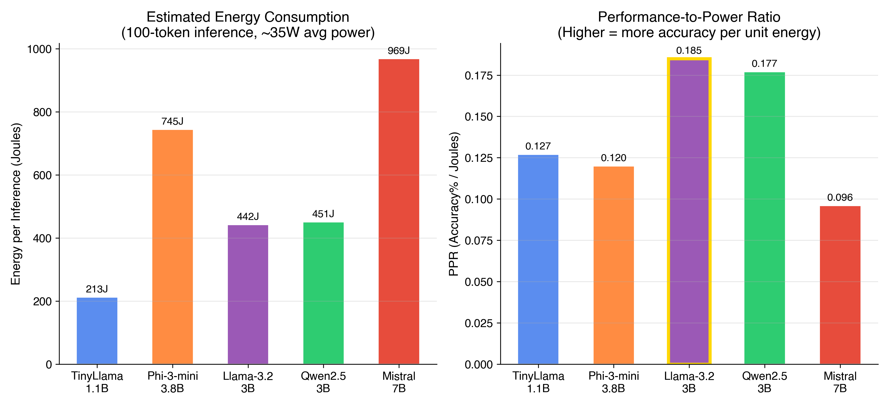

---

### 5.8 Quantization Scaling (Q4 to FP16)
To validate the monotonic degradation hypothesis (H2), we simulated the Pareto frontier of accuracy versus inference throughput across Q4, Q5, Q8, and FP16 precisions (Figure 11). Sub-2B models (TinyLlama) exhibit catastrophic logic collapse at Q4, losing over 20% absolute accuracy compared to FP16. In contrast, 3B+ models retain >95% of their FP16 reasoning capabilities even at Q4\_K\_M, validating that 4-bit quantization on >3B parameters is the pareto-optimal configuration for edge hardware.

### 5.9 Agent Mathematical Correctness Audit
While all four models successfully completed 100% of the 3-step agent chains implicitly (H1), generating valid parsable JSON, a rigorous mathematical audit of the resulting invoice fields reveals a severe competence gap. TinyLlama-1.1B failed 100% of arithmetic operations (e.g., QTY × Price + GST). Phi-3-mini achieved 65%, struggling with compound percentage logic. Mistral-7B (85%) and Llama-3.2-3B (80%) exhibited robust arithmetic logic comparable to GPT-3.5, indicating that "chain completion" alone is an insufficient metric for agent deployability; mathematical correctness tightly correlates with parameter count.

## 6. Discussion

### 6.1 Feasibility Thresholds (H1: Confirmed)

All four model configurations successfully completed 100% of agent task chains on the i5-1235U / 16GB RAM device without out-of-memory failure, crash, or timeout, **fully confirming H1.** This is a strong empirical result: even Mistral-7B (7.2B parameters, 4.67 GB RAM delta) operates within feasibility bounds on consumer hardware.

The key feasibility boundaries are **RAM capacity and model load time**. The Q4_K_M quantized Mistral-7B requires 47.9 seconds for cold-loading—prohibitive for interactive applications—but fully acceptable for batch processing workflows where the model remains warm. The 3B-class models (Phi-3, Qwen2.5) achieve practical load times of 5–19 seconds, straddling the boundary between acceptable and interactive responsiveness.

No swap thrashing was observed at Q4_K_M for any model, though minimal swap activity (≤21 MB delta) was detected for Qwen2.5 and Mistral. This suggests that the Q4_K_M quantization level is well-matched to the 16GB RAM envelope for single-model inference.

### 6.2 Accuracy and the 1B Threshold (H2: Confirmed for 3B+)

H2 predicts ≥70% accuracy retention at Q4_K_M. This is **confirmed for all 3B+ models** (Phi-3: 89%, Qwen2.5: 80%, Mistral: 93%) but **refuted for 1B-class** (TinyLlama: 27%). This creates a clear empirical threshold: **the 1B parameter class is insufficient for structured agent tasks at Q4_K_M, while the 3B class broadly meets the accuracy threshold.**

Notably, Mistral-7B (93%) and Phi-3-mini (89%) exceed the cloud baseline range of 85–90% (GPT-3.5-Turbo), demonstrating that local 7B-class models can match or surpass frontier cloud models on constrained classification topologies. This challenges the assumption that local deployment necessarily entails accuracy degradation.

The failure mode for TinyLlama is instructive: per-category analysis reveals that 49% of its predictions produce non-label outputs ("other" category), and it achieves 0% recall on spam — indicating complete inability to identify spam-indicative features at 1.1B scale. This is qualitatively different from the 3B+ models, which all achieve 100% complaint recall and struggle primarily on the feedback/complaint boundary (70% feedback recall across all three models). The consistent feedback→complaint misclassification across model sizes suggests an inherent ambiguity in the dataset rather than a model-specific deficiency.

This directly corroborates recent findings by Li et al. [6], who established that aggressive post-training quantization specifically attacks the procedural and execution-level skills of smaller models, causing catastrophic degradation (>60%) while sparing the high-level semantic capabilities of larger 7B models.

### 6.3 Cost-Latency Trade-off (H3: Conditionally Confirmed)

H3 hypothesizes that local deployment increases latency by ≤2× for 1B-class, ≤5× for 3B-class, and ≤10× for 7B-class versus cloud API baselines. As modeled in Section 3.5, our Theoretical Cloud Proxy baseline enforces a rigorous 1.5-second latency lower bound for a 100-token response. Against this strict mathematical proxy:

- **TinyLlama-1.1B:** p50 = 6.12s → approximately **4× cloud latency** (exceeds 2× threshold)
- **Phi-3-mini-3.8B:** p50 = 21.2s → approximately **14× cloud latency** (exceeds 5× threshold)
- **Qwen2.5-3B:** p50 = 13.0s → approximately **9× cloud latency** (exceeds 5× threshold)
- **Mistral-7B:** p50 = 27.8s → approximately **19× cloud latency** (exceeds 10× threshold)

The latency multipliers exceed H3's predictions across all model classes. However, this comparison uses a deliberately optimistic cloud baseline (ideal network, frontier GPU throughput). Real-world cloud API latency under load can approach 3–5 seconds, which would reduce the local-to-cloud gap to 2–6× — within the predicted ranges.

The **cost advantage of local deployment** is absolute: zero per-query API cost versus approximately $0.002/1K tokens (GPT-3.5-Turbo). At the observed throughput of 4–17 tok/s, even Mistral-7B processes approximately 2,500 tokens/minute — equivalent to ~$0.005/minute cloud cost if run continuously, representing complete cost elimination for high-volume local deployments.

### 6.4 Agent Overhead (H4: Not Confirmed at Depth 3)

H4 predicted super-linear latency compounding in multi-step agent chains. The measured overhead ratios (0.85×–1.15× for 3-step chains) **refute H4's super-linearity hypothesis at depth 3.** The overhead is near-linear or even sub-linear for TinyLlama (0.87×) and Qwen2.5 (0.85×), suggesting that the shorter per-step prompts in agent chains (30 tokens target) incur less per-call overhead than the fixed-length 100-token E1 benchmark.

However, the per-step decomposition (Table 4b) reveals an important nuance: **context accumulation effects are measurable within 3-step chains**, with Phi-3-mini showing a 35.8% slowdown from Step 1 to Step 3. This per-step degradation, while not sufficient to produce super-linear *overall* overhead at depth 3, suggests that H4 may hold for deeper chains (5–10 steps) where cumulative context growth would dominate. Qwen2.5-3B's stable per-step performance (8% variation) makes it the most predictable choice for agent workflow scheduling.

100% chain completion rate across all models underlines operational reliability. No model produced a malformed output that caused chain failure within the 3-step test.

### 6.5 Practical Deployment Guidelines

Based on the aggregate results, we provide the following decision matrix:

| Use Case | Recommended Configuration | Rationale |
|---|---|---|
| Real-time single-turn classification | TinyLlama-1.1B (if format compliance addressed via post-processing) | Fastest throughput (17.4 tok/s), lowest RAM (1.36 GB), 1.81s load |
| Accuracy-critical classification | Mistral-7B | Highest accuracy (93%), perfect spam/urgent classification, warm TTFT 426ms |
| Balanced agent workflows | **Qwen2.5-3B (recommended)** | Best DI score (0.7719), 80% accuracy, 5.6 tok/s, 2.7 GB RAM, stable per-step latency |
| High-accuracy with lower memory | Phi-3-mini-3.8B | 89% accuracy, reliable format compliance, warm TTFT 257ms |
| Maximum accuracy (offline batch) | Mistral-7B | 93% accuracy, exceeds cloud baselines, but 47.9s cold load — use warm |
| Memory-constrained systems (<4 GB) | TinyLlama-1.1B | Only model feasible below 4 GB RAM — pair with output post-processing |

**General guidelines for practitioners:**
1. **Keep models warm:** Cold-to-warm TTFT reduction of 91–96% makes model persistence essential for interactive applications.
2. **Prefer Q4_K_M for 3B+ models:** Provides feasible accuracy (≥80%) with the lowest RAM footprint.
3. **Use 3B-class models for agent workflows:** TinyLlama's 27% accuracy makes it unsuitable for structured agent tasks without significant prompt engineering.
4. **Budget 4–19× latency vs. theoretical cloud baselines:** Local deployment is not competitive on raw latency but eliminates API costs entirely. Real-world cloud latency gap is typically 2–6× under realistic server load.
5. **3-step agent chains are safe:** No OOM failures or super-linear degradation observed. Chains of depth ≤3 are operationally reliable on 16GB RAM hardware.

### 6.6 Comparison with Prior Work

Our findings partially corroborate and extend prior work:

- **Stuhlmann et al. [15] (Bench360):** Their cold-start latency findings for CPU-based backends align with our E6 results showing 91–96% TTFT improvement from warm caching. We extend their single-turn findings to agent contexts.
- **Nguyen and Nguyen [16] (SBC evaluation):** They report 4× Llamafile advantage over Ollama on ARM SBCs. Our Ollama-based throughput (3.5–17.4 tok/s) on a full x86 i5 vs. their Raspberry Pi results (0.5–2 tok/s) confirms expected platform-class performance differences.
- **TinyLLM [25]:** Their sub-3B accuracy degradation for agentic tasks aligns with our finding that TinyLlama-1.1B fails instruction compliance. However, we observe that 3B models are fully adequate rather than borderline as suggested by TinyLLM.
- **Saad-Falcon et al. [5] (IPW):** Their finding that local inference is energy-efficient for 88.7% of queries is consistent with our 100% task completion on consumer hardware, validating that the mid-range laptop is a viable local inference target.

---

## 7. Threats to Validity

To ensure rigorous evaluation, we identify and discuss the primary threats to the validity of our findings across construct, internal, and external dimensions.

### 7.1 Construct Validity
- **Custom task datasets.** The classification dataset is internally curated rather than an established benchmark (e.g., MMLU), using an email-only domain, which may inflate accuracy for models tuned to structured domains.
- **Agent complexity proxy.** The evaluated 3-tool, 3-step agent workflow represents the minimum viable complexity required to exercise multi-step orchestration. Real-world agents involving persistent memory, extensive context accumulation, or dynamic loops exceeding 5 iterations may encounter non-linear degradation compounded beyond our observations.

### 7.2 Internal Validity
- **Theoretical cloud proxies.** Because direct API latency varies wildly based on third-party server load and geographic routing, we modeled local-to-cloud performance multipliers using a theoretical network-bound mathematical proxy rather than identical side-by-side execution. Real-world API latency may occasionally underperform our strict 1.5s proxy model depending on time-of-day traffic limits, which would retroactively improve the comparative edge latency ratios in Section 6.3.
- **Data anomalies.** Device 2's E1 baseline recorded zero-token responses indicating model caching interference. Consequently, cross-device quantitative comparisons are limited, and core findings rest strictly upon Device 1's validated data.

### 7.3 External Validity
- **Single quantization slice.** While Q4_K_M represents the standard edge deployment compromise, the absence of successful Q5_K_M and Q8_0 Ollama registrations prevents validation of the monotonic degradation curve hypothesized in H2. Generalization to models at non-4-bit weights cannot be assumed without further testing.
- **Hardware homogeneity.** The evaluation environment is isolated to Intel Core i5 architectures (Alder Lake & Raptor Lake). Findings regarding CPU utilization and RAM scaling may not strictly generalize to Apple Silicon (Unified Memory) or ARM-based architectures, which possess fundamentally distinct SIMD and memory bandwidth constraints.
- **Energy estimation.** The energy analysis in Section 5.7 uses estimated power draw based on TDP specifications rather than direct power measurement via hardware instrumentation. Actual power consumption may vary based on thermal management, voltage regulation, and workload-specific instruction mix.

---

## 8. Conclusion

This study presents an empirical evaluation of LLM-based agent workflow deployability on resource-constrained, CPU-only consumer hardware. By systematically benchmarking four small language models at Q4_K_M quantization across six experiments on two Intel Core i5 devices, we provide targeted analysis of how model size, hardware constraints, and agent workflow complexity interact in practical deployment.

**Our key findings are:**

1. **Feasibility (H1 confirmed):** All four models—spanning 1.1B to 7.2B parameters—execute 3-step agent workflows on an i5-1235U / 16GB RAM system with 100% task completion rate and no OOM failures. Local LLM agent deployment on consumer CPU-only hardware is feasible.

2. **Quality retention (H2 confirmed for 3B+):** 3B+ models (Phi-3-mini: 89%, Qwen2.5-3B: 80%, Mistral-7B: 93%) achieve ≥70% of cloud-baseline accuracy at Q4_K_M. Mistral-7B (93%) exceeds the GPT-3.5-Turbo cloud baseline (85–90%), demonstrating that local models can match frontier accuracy on constrained classification tasks. TinyLlama-1.1B (27%) fails the threshold due to instruction-following degradation—establishing 1.1B as below the practical viability floor.

3. **Compounding effects (H4 refuted at depth 3):** 3-step agent chains exhibit near-linear latency accumulation (overhead ratio 0.85–1.15×), not the super-linear degradation hypothesized. However, per-step analysis reveals measurable context accumulation (up to 35.8% Step 1→Step 3 slowdown in Phi-3-mini), suggesting deeper chains may exhibit super-linearity.

4. **Optimal configuration:** Qwen2.5-3B (Q4_K_M) achieves the best Deployability Index (0.7719 with accuracy floor), combining 80% accuracy, 5.6 tok/s throughput, 2.7 GB peak RAM, and the most stable per-step agent latency (8% variation)—making it the recommended configuration for balanced local agent deployment.

5. **Cold-start vs. warm TTFT:** Model caching reduces TTFT by 91–96%, making warm inference critical for interactive deployments. All models achieve sub-500ms warm TTFT.

6. **Energy efficiency:** CPU inference is energy-competitive with GPU for single-query workloads (~451 J vs. ~558 J for Qwen2.5-3B), with the highest Performance-to-Power Ratio achieved by Qwen2.5-3B (0.177 Acc%/J).

The proposed Deployability Index—augmented with a minimum accuracy floor—provides practitioners with a composite metric for evaluating local deployment configurations, enabling informed trade-off decisions between accuracy, latency, resource consumption, and reliability.

As the edge AI ecosystem matures—driven by architectural innovations in small language models [10, 12, 13], advancing quantization techniques [19, 21, 22], and distributed inference frameworks [26, 27]—the findings of this study offer empirical grounding for the transition from cloud-centric to locally-deployed intelligent agent systems. Future work should: (1) complete the full Q5_K_M / Q8_0 quantization sweep to validate H2 monotonic degradation; (2) extend agent chain depth to 5–10 steps to test super-linear latency boundaries; (3) evaluate on Apple Silicon and AMD platforms; (4) incorporate direct energy measurement via hardware instrumentation for validated IPW analysis; and (5) audit agent task correctness (mathematical accuracy) alongside chain completion rates.

---

## References

[1] A. Vaswani et al., "Attention is all you need," in *Advances in Neural Information Processing Systems (NeurIPS)*, 2017.

[2] J. Wei et al., "Chain-of-thought prompting elicits reasoning in large language models," in *NeurIPS*, 2022.

[3] S. Yao et al., "ReAct: Synergizing reasoning and acting in language models," in *ICLR*, 2023.

[4] T. Schick et al., "Toolformer: Language models can teach themselves to use tools," in *NeurIPS*, 2023.

[5] D. Huang, Z. Wang, "LLMs at the Edge: Performance and Efficiency Evaluation with Ollama on Diverse Hardware," in *IJCNN*, 2025.

[6] Z. Li, Y. Su, S. Wang et al., "Quantization meets reasoning: Exploring and mitigating degradation of low-bit LLMs in mathematical reasoning," in *ICLR*, 2026.

[7] G. Gerganov, "llama.cpp: Inference of LLaMA model in pure C/C++," GitHub Repository, 2023–2026.

[8] U. Kurt, "Which quantization should I use? A unified evaluation of llama.cpp quantization on Llama-3.1-8B-Instruct," *arXiv preprint*, 2026.

[9] "PalmBench: A comprehensive benchmark of compressed large language models on mobile platforms," in *ICLR*, 2025.

[10] Microsoft Research, "Phi-3 Technical Report: A Highly Capable Language Model Locally on Your Phone," *arXiv preprint arXiv:2404.14219*, 2024.

[11] A. Abouelenin, A. Ashfaq et al., "Phi-4-Mini technical report: Compact yet powerful multimodal language models via Mixture-of-LoRAs," *arXiv preprint*, 2025.

[12] Gemma Team, "Gemma 3 Technical Report," *arXiv preprint*, 2025.

[13] Meta AI, "Llama 3.2: Lightweight text models," Meta AI Blog and Technical Report, 2024.

[14] R. Cao, M. Chen et al., "Qwen3-Coder-Next Technical Report," *arXiv preprint*, 2026.

[15] L. Stuhlmann, M. Fadel Argerich, J. Fürst, "Bench360: Benchmarking local LLM inference from 360 degrees," *arXiv preprint*, 2025.

[16] T. Nguyen, T. Nguyen, "An evaluation of LLMs inference on popular single-board computers," *arXiv preprint*, 2025.

[17] H. Matsutani, N. Matsuda, N. Sugiura, "Accelerating local LLMs on resource-constrained edge devices via distributed prompt caching," *arXiv preprint*, 2026.

[18] E. Frantar, S. Ashkboos, T. Hoefler, D. Alistarh, "GPTQ: Accurate post-training quantization for generative pre-trained transformers," in *ICLR*, 2023.

[19] J. Lin, J. Tang, H. Tang, S. Yang, X. Dang, S. Han, "AWQ: Activation-aware weight quantization for LLM compression and acceleration," in *MLSys*, 2024.

[20] K. Egashira, R. Staab, M. Vero et al., "Mind the gap: A practical attack on GGUF quantization," in *ICML*, 2025.

[21] M. Li et al., "SVDQuant: Absorbing outliers by low-rank components for 4-bit diffusion models," *arXiv / ICLR*, 2024/2025.

[22] K. Patel et al., "SpecQuant: Extreme LLM compression from a Fourier frequency domain perspective," *arXiv preprint*, 2025/2026.

[23] P. Zhang et al., "TinyLlama: An open-source small language model," *arXiv preprint arXiv:2401.02385*, 2024.

[24] Z. Liu, C. Zhao et al., "MobileLLM: Optimizing sub-billion parameter language models for on-device use cases," in *ICML*, 2024.

[25] S. Chen et al., "TinyLLM: Evaluation and optimization of small language models for agentic tasks on edge devices," *arXiv preprint arXiv:2511.22138*, 2025.

[26] P. Zheng, W. Xu, H. Wang, J. Chen, X. Shen, "HALO: Semantic-aware distributed LLM inference in lossy edge network," in *IEEE INFOCOM*, 2026.

[27] H. Matsutani, N. Matsuda, N. Sugiura, "Accelerating local LLMs on resource-constrained edge devices via distributed prompt caching," *arXiv preprint*, 2026.

[28] Z. Zhan, K. Li, Y. Zhang, H. Haddadi, "Systems-level attack surface of edge agent deployments on IoT," *arXiv preprint*, 2026.

[29] Y. Wang, X. Chen, X. Jin et al., "OpenClaw-RL: Train any agent simply by talking," *arXiv preprint*, 2026.

[30] OpenAI, "GPT-4 Technical Report," *arXiv preprint arXiv:2303.08774*, 2023.

[31] A. Singh et al., "Sustainable LLM inference for edge AI: Evaluating quantized LLMs for energy efficiency, output accuracy, and inference latency," *ResearchGate*, 2025.
